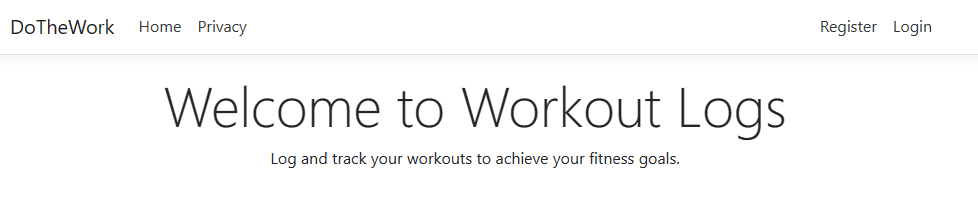
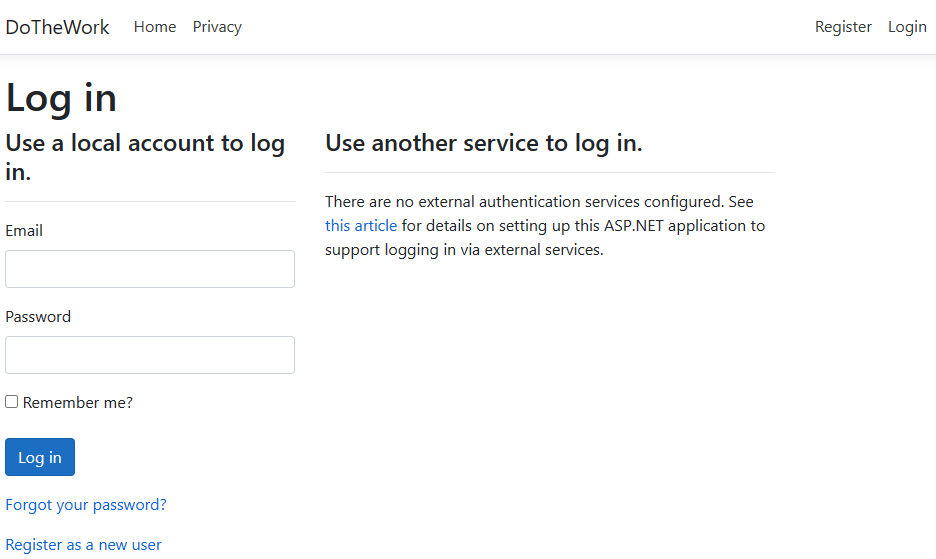
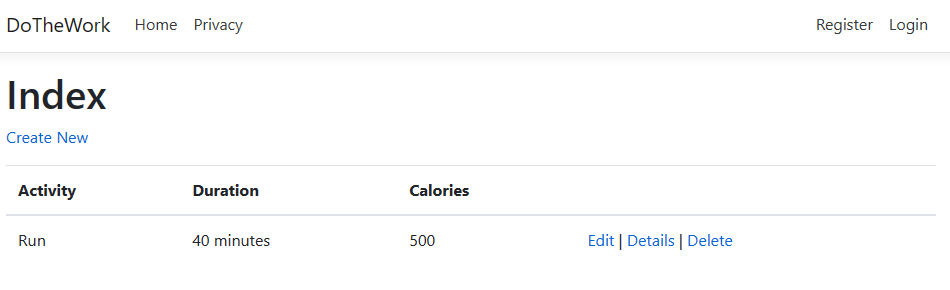

# 🏋️‍♀️ Workout Logger Web Application

Welcome to **Workout Logger**, the ultimate workout tracking solution! 🚀

## 🌟 Features

- 💪 Log and track your workouts effortlessly.
- 🎯 MVC design patterns for organized code structure.
- 🛠️ Built with ASP.NET, Entity Framework, and Razor forms.
- 🎨 Customize UI with CSS and Bootstrap classes.
- 🔍 Quick search functionality for finding past workouts.
- 🔐 Secure user authentication for data privacy.
- 📊 Utilizes SQL database to store and manage workout data.

## 🚀 Getting Started

1. Clone the repository: `git clone https://github.com/yourusername/workout-logger.git`
2. Navigate to the project directory: `cd workout-logger`
3. Install dependencies: `dotnet restore`
4. Configure your SQL database connection in `appsettings.json`.
5. Run migrations: `dotnet ef database update`
6. Launch the app: `dotnet run`
7. Open your browser and go to `http://localhost:5000`

## 📸 Screenshots

## 🤝 Contributing

Contributions are welcome! Just fork this repository, create a new branch, commit your changes, and submit a pull request. Let's make this app even better together! 🤗

## 📝 License

This project is licensed under the MIT License - see the [LICENSE](LICENSE) file for details.

---

Created with ❤️ by [Your Name](https://github.com/Miguel619)
